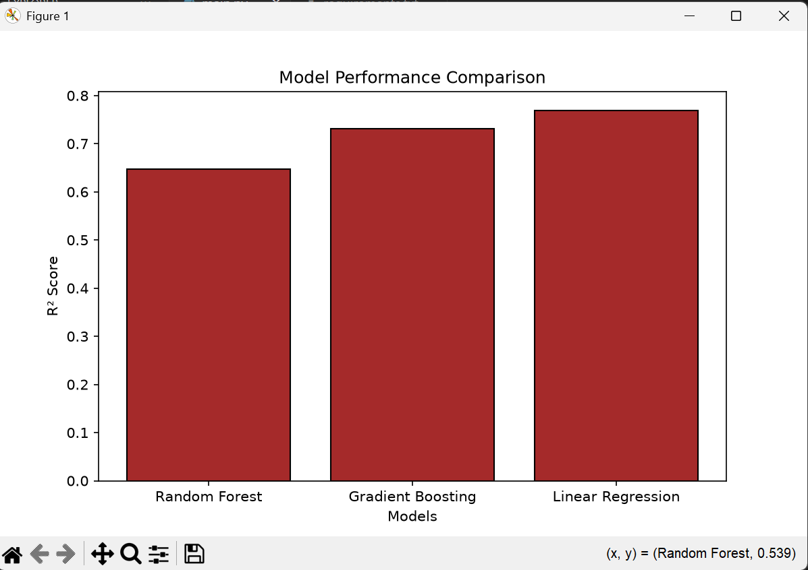

# 🎓 Student Performance Prediction using Machine Learning

Predicting student exam scores by analyzing study habits, attendance, academic history, and other performance-related factors — powered by Random Forest, Gradient Boosting, and Linear Regression.


---

## 📌 Overview

Academic performance depends on far more than just study hours — attendance, teacher quality, parental involvement, and prior achievement all play a role. This project builds and compares multiple regression models to **predict a student's final exam score** based on a rich set of behavioral, academic, and environmental factors.

The goal is twofold:
- 📊 **Explore** which factors most strongly influence exam performance
- 🤖 **Predict** exam scores using machine learning, comparing model accuracy across algorithms

---

## ✨ Features

- 🧹 **Data Cleaning** — handles missing values via mode imputation, checks for duplicates
- 📈 **Exploratory Data Analysis (EDA)** — visualizes score distributions and key relationships (study hours, attendance, previous scores vs. exam score)
- 🔠 **Categorical Encoding** — one-hot encoding for non-numeric features
- ⚖️ **Feature Scaling** — standardization using `StandardScaler`
- 🤖 **Multiple ML Models** — trains and compares:
  - Random Forest Regressor
  - Gradient Boosting Regressor
  - Linear Regression
- 📉 **Model Evaluation** — MAE, RMSE, and R² Score for each model
- 🎯 **Visual Diagnostics** — actual vs. predicted scores, residual plots, and model comparison bar chart

---

## 🗂️ Project Structure

```
Student-Performance-Prediction-using-Machine-Learning/
│
├── project_outputs/              # Generated plots & visualizations
│   ├── Distribution-of-Exam-Scores.png
│   ├── Hours-Study-VS-Exam-Score.png
│   ├── Attendance-VS-Exam-Score.png
│   ├── Previous-Score-VS-Exam-Score.png
│   ├── Actual-VS-Model-Prediction.png
│   ├── Residual-Plot.png
│   └── Model-Comparison.png
│
├── StudentPerformanceFactors.csv # Dataset
├── main.py                       # Main script (EDA + model training + evaluation)
├── requirements.txt              # Project dependencies
├── LICENSE                       # MIT License
└── README.md                     # Project documentation
```

---

## 🧠 Dataset

The dataset (`StudentPerformanceFactors.csv`) includes features such as:

| Feature | Description |
|---|---|
| `Hours_Studied` | Weekly study hours |
| `Attendance` | Attendance percentage |
| `Previous_Scores` | Prior academic performance |
| `Teacher_Quality` | Rating of teaching quality |
| `Parental_Education_Level` | Highest education level of parents |
| `Distance_from_Home` | Distance between home and school |
| ... | Additional academic & lifestyle factors |
| `Exam_Score` | 🎯 Target variable — final exam score |

---

## ⚙️ Installation

```bash
# Clone the repository
git clone https://github.com/talha-siddiqui137/Student-Performance-Prediction-using-Machine-Learning.git
cd Student-Performance-Prediction-using-Machine-Learning

# (Optional) Create a virtual environment
python -m venv venv
source venv/bin/activate      # On Windows: venv\Scripts\activate

# Install dependencies
pip install -r requirements.txt
```

---

## ▶️ Usage

Run the main script to perform EDA, train the models, and view evaluation results:

```bash
python main.py
```

This will:
1. Load and clean the dataset
2. Generate exploratory visualizations
3. Encode categorical variables and scale features
4. Train Random Forest, Gradient Boosting, and Linear Regression models
5. Print a comparison table of MAE, RMSE, and R² Score
6. Display actual vs. predicted and residual plots

---

## 📊 Results

| Model | MAE | RMSE | R² Score |
|---|---|---|---|
| Random Forest | *TBD* | *TBD* | *TBD* |
| Gradient Boosting | *TBD* | *TBD* | *TBD* |
| Linear Regression | *TBD* | *TBD* | *TBD* |

> Fill in your actual output values from `results_df` here after running the script.

**Model Comparison**



---

## 🛠️ Tech Stack

- **Language:** Python 3.10+
- **Data Handling:** Pandas, NumPy
- **Visualization:** Matplotlib
- **Machine Learning:** scikit-learn (Random Forest, Gradient Boosting, Linear Regression)

---

## 🚀 Future Improvements

- [ ] Add hyperparameter tuning (GridSearchCV / RandomizedSearchCV)
- [ ] Try additional models (XGBoost, LightGBM)
- [ ] Add cross-validation for more robust evaluation
- [ ] Build a simple web app (Streamlit/Flask) for live predictions
- [ ] Feature importance analysis for interpretability

---

## 🤝 Contributing

Contributions, issues, and feature requests are welcome!
Feel free to check the [issues page](https://github.com/talha-siddiqui137/Student-Performance-Prediction-using-Machine-Learning/issues) or submit a pull request.

---

## 📄 License

This project is licensed under the [MIT License](LICENSE) — feel free to use, modify, and distribute it.

---

## 👤 Author

**Talha Siddiqui**
GitHub: [@talha-siddiqui137](https://github.com/talha-siddiqui137)

---

⭐ If you found this project useful, consider giving it a star on GitHub!
